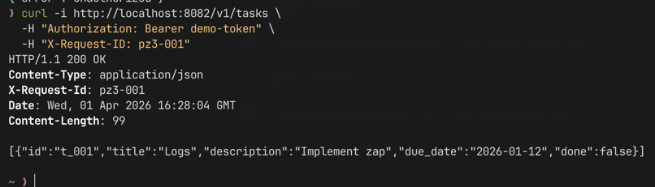
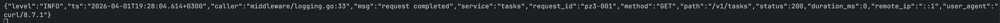
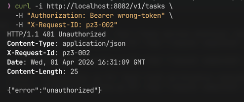
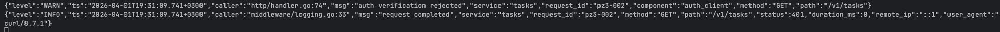
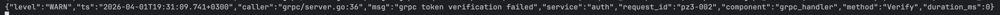
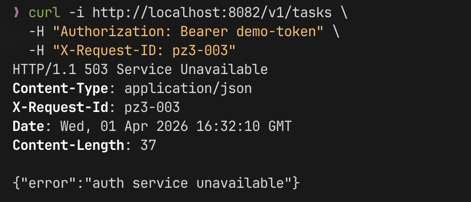
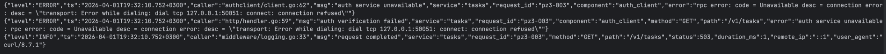

# Практическое занятие №3

## Рузин Иван Александрович ЭФМО-01-25

### Структурированное логирование с использованием zap

---

## 1. Краткое описание выбранного логгера

В работе использован логгер **zap**.

Причины выбора:

- высокая производительность по сравнению с альтернативами;
- нативная поддержка JSON-логов;
- строгая типизация полей (zap.String, zap.Int и т.д.);
- удобное добавление контекста (service, request_id и др.);
- часто используется в production-сервисах.

---

## 2. Стандарт полей логов

Во всех сервисах используется единый формат логов.

Обязательные поля:

- `level` — уровень логирования (INFO, WARN, ERROR)
- `ts` — время события
- `service` — имя сервиса (auth / tasks)
- `request_id` — идентификатор запроса
- `method` — HTTP метод
- `path` — путь запроса
- `status` — код ответа
- `duration_ms` — длительность обработки запроса

Дополнительные поля:

- `component` — слой системы (handler, auth_client, grpc_handler)
- `error` — текст ошибки (без чувствительных данных)
- `remote_ip` — IP клиента
- `user_agent` — User-Agent клиента
- `has_auth` — факт наличия заголовка Authorization

В логах сознательно не используются:

- пароли
- access/refresh токены
- cookies
- любые секретные значения

---

## 3. Примеры лог-событий

### Успешный запрос request_id="pz3-001"



Tasks service:



Auth service:


Оба сервиса используют одинаковый `request_id`, что позволяет отследить полный путь запроса.

---

### Запрос с ошибкой (неверный токен) request_id="pz3-002"



Tasks service:



Auth service:



Ошибка логируется с указанием компонента и без раскрытия содержимого токена.

---

### Auth service недоступен request_id="pz3-003"



Tasks service:



В данном случае фиксируется ошибка взаимодействия между сервисами (gRPC), а клиент получает безопасное сообщение.

---

## 4. Инструкция запуска и проверки

### Установка зависимостей

```bash
go mod tidy
````

---

### Запуск сервисов

Auth:

```bash
cd services/auth
AUTH_PORT=8081 AUTH_GRPC_PORT=50051 go run ./cmd/auth
```

Tasks:

```bash
cd services/tasks
TASKS_PORT=8082 AUTH_GRPC_ADDR=localhost:50051 go run ./cmd/tasks
```

---

### Проверка работы

#### 1. Успешный запрос

```bash
curl -i http://localhost:8082/v1/tasks \
  -H "Authorization: Bearer demo-token" \
  -H "X-Request-ID: pz3-001"
```

---

#### 2. Ошибка (неверный токен)

```bash
curl -i http://localhost:8082/v1/tasks \
  -H "Authorization: Bearer wrong-token" \
  -H "X-Request-ID: pz3-002"
```

---

#### 3. Auth недоступен

Остановить Auth сервис и выполнить:

```bash
curl -i http://localhost:8082/v1/tasks \
  -H "Authorization: Bearer demo-token" \
  -H "X-Request-ID: pz3-003"
```

---

## Вывод

В ходе выполнения работы было внедрено структурированное логирование с использованием zap.

Все сервисы используют единый формат логов, что упрощает анализ и поиск проблем.
Реализовано логирование жизненного цикла запроса и добавлен `request_id` для корреляции.

Также обеспечено корректное логирование ошибок без утечки чувствительных данных.
При межсервисных вызовах request_id передаётся между сервисами, что позволяет отслеживать цепочку выполнения запроса
целиком.